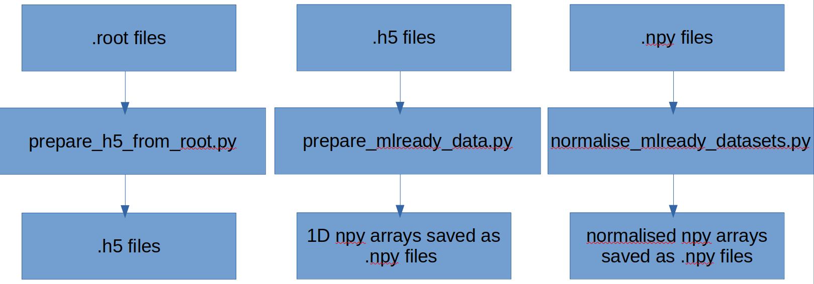

# Data Pre-Processing:

All scripts used in converting data stored in .root file trees format to ML ready .npy files containing normalised 1D arrays.

The workflow follows the diagram:

The data_features_definitions.py file only contains definitions for what are the interesting features when processing different types of data. Here we only process the delphes_1l type data.

The prepare_mlready_data.py file produces a 1D array with all the interesting features per event. Thus, the final .npy file contains N 1D arrays, where N is the total number of events that pass the following requirements:

* All requirements imposed by the delphes_1l structure.
* Exactly 1 lepton is present.
* At least 4 jets are present.
* At least 2 of the 4 jest are btagged.

The 7 most energetic jets are kept for each event. The features that are kept are as follows:

met_feats = ["phi","pt","px","py"]
lep_feats = ["pt","eta","phi","en","px","py","pz"]
jet_feats = ["pt","eta","phi","en","px","py","pz","btag"]

Thus, in total, we have 67 features. The .npy file produced in prepare_mlready_data.npy should have 67 columns and nevets rows. These .npy arrays can then be imported into normalise_mlready_dataset.py where they are normalised using different normalisations available in sklearn (and possibly beyond, in the future).
